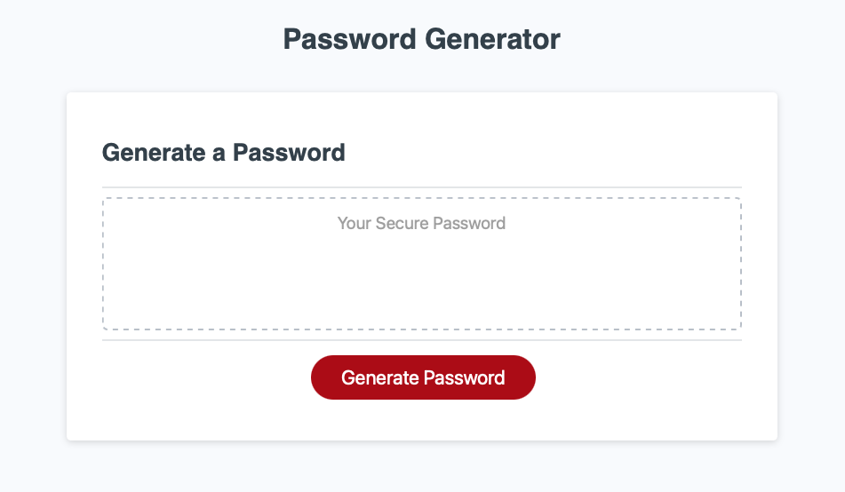

# password-generator
Random password generator

Link https://r-a-exe.github.io/password-generator/

## High-Level Description

Provide a randomly generated password given certain criteria.

## Criteria

The generator takes in 5 criteria from the user through a prompt and 4 alerts:

    1- The size of the password: the user must enter a number between 8 and 128; any other value will cause the prompt to loop;
    2- Lowercase letters: using the alert buttons, the user will indicate if lowercase letters are to be included in the password;
    3- Uppercase letters: using the alert buttons, the user will indicate if uppercase letters are to be included in the password;
    4- Numbers: using the alert buttons, the user will indicate if numbers are to be included in the password;
    5- Special characters: using the alert buttons, the user will indicate if special characters are to be included in the password;

At least one of the 4 types of characters must be included; not including any will cause the alerts to loop.

## Criteria Selection

The JS code contains 4 static arrays, one for each character type. A fifth blank array is also initiated; this array will constitue the character pool for the password randomizer.
As the user responds to each prompt, the data is stored as follows:

    1- The size is stored in a variable that will dictate the limit of the for loop that will generate each character.
    2- For each of the other alerts, the user input's boolean value is tested and processed as follows:
        a- TRUE:
            - The corresponding array of character is concatenated to the blank array, adding the chosen character types to the pool of choices;
            - A boolean variable is specific for each alert is stored as false (unfulfilled), and will be used to validate that the criteria of the user have been met by the generator.
        b- FALSE:
            - The corresponding array of characters is ignored, leaving its content outside of the pool of choices;
            - The boolean variable is stored as true(fulfilled)

## Password Generation

The randomizer, consisting of a simple randm number generator between 0 (inclusive) and 1 (non-inclusize) multiplied by the length of the concatenated array, will generate the random characters which would then be added to a string, the password-to-be.

## Validation

In order to validate that the password contains at least one character from the specified types, a validation function is called, and passed the string, and each of the boolean values collected during the 
Criteria Selection part.

The validation function loops through each character of the password and conducts the following tests:

    Is the boolean value of lowercase set as TRUE:
    - If yes, this test is ignore because either the user did not request lowercase letters, or this criteria has already been tested and succeded;
    - If not, the lowercase array is checked to see if it contains the current character:
        - If yes, the boolean value of lowercase is set to true;
        - If not, we move on to conduct the same test on the uppercase, number and special characters.

The last step of this loop is to check if all 4 criteria are true, if so, the function returns true and the password is displayed. If the the loop ends and not all the criteria are met, the Password Generation function restarts, and generates an new password, which will also have to be validated.
